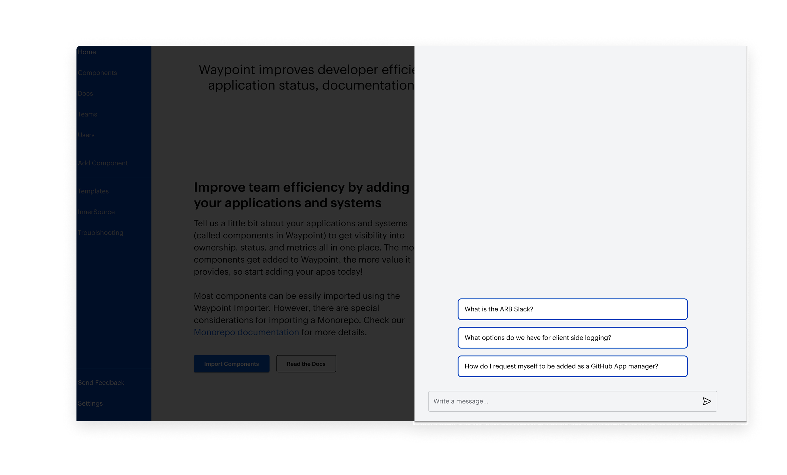
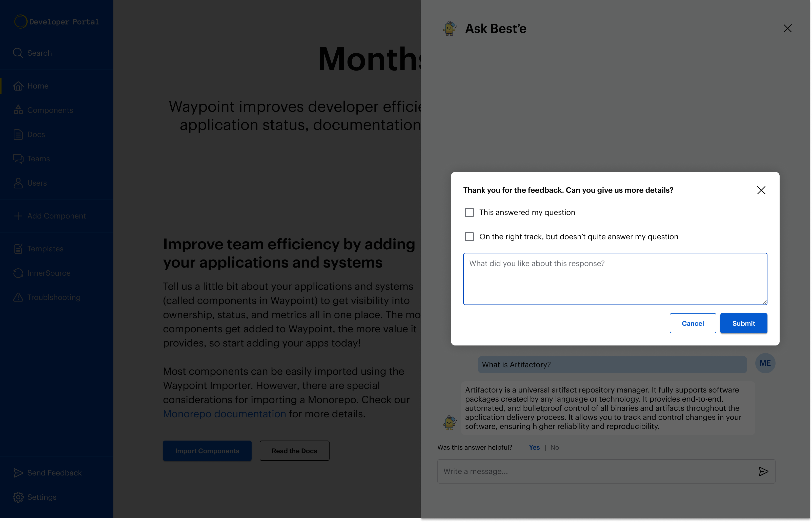
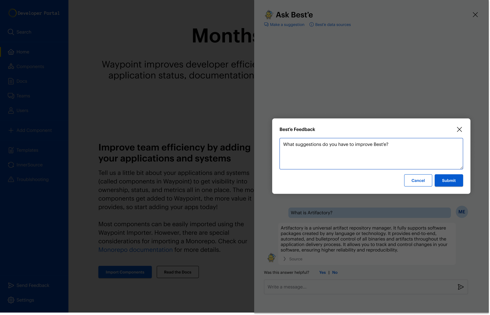
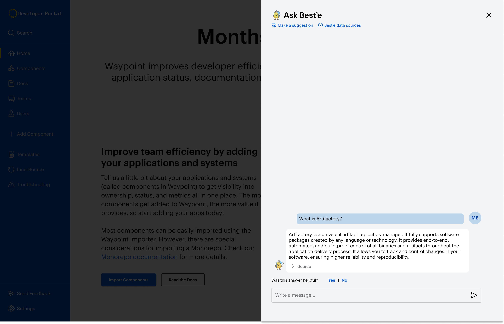
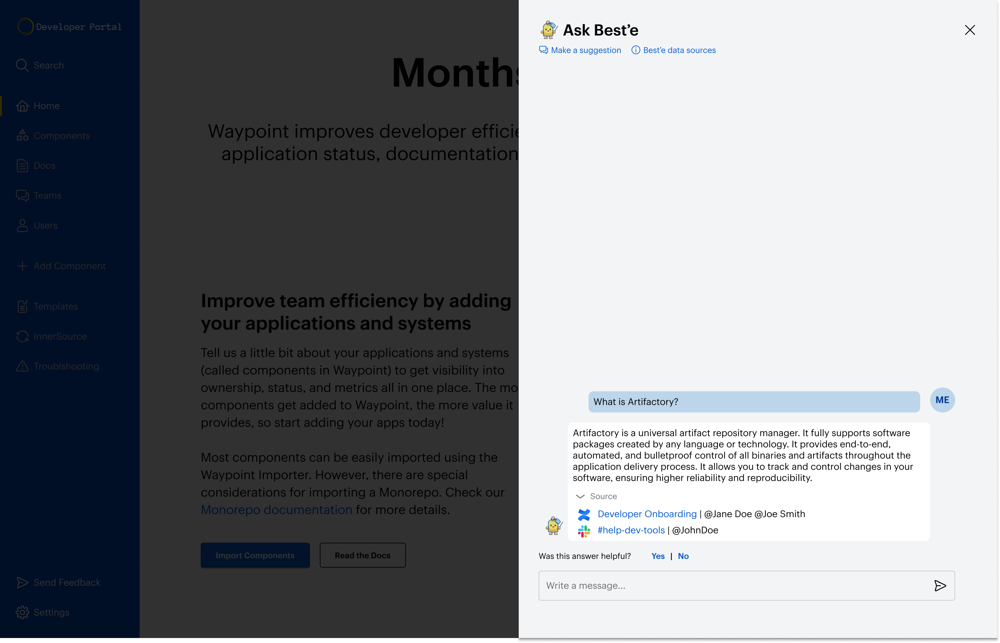
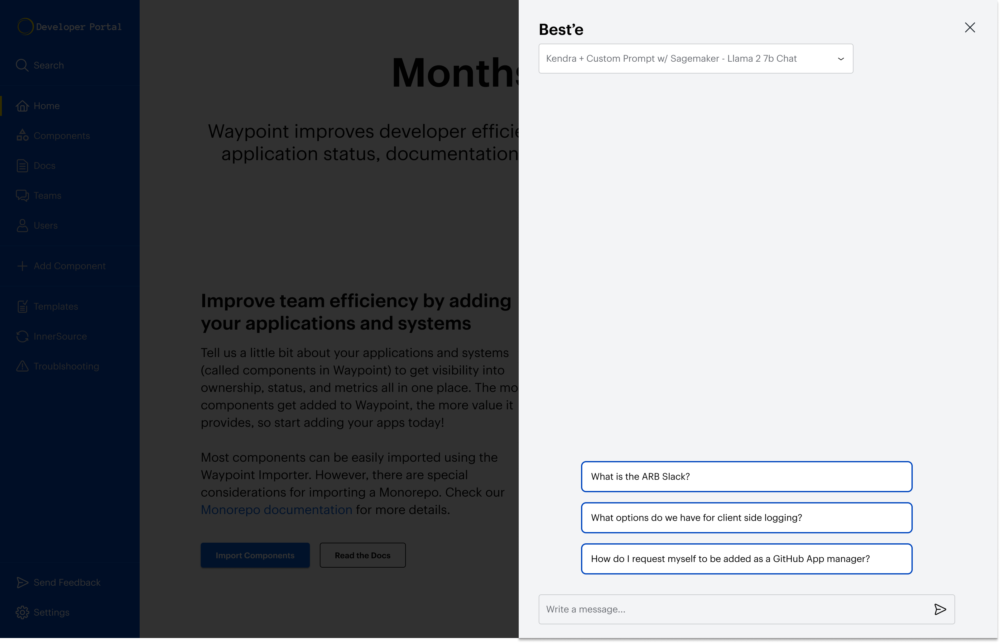
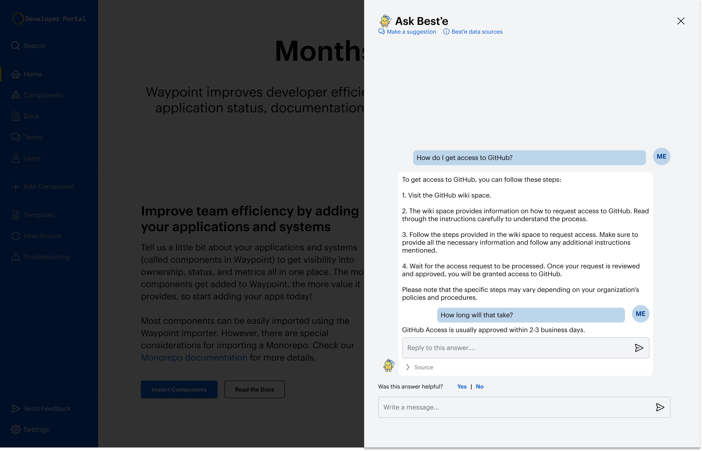
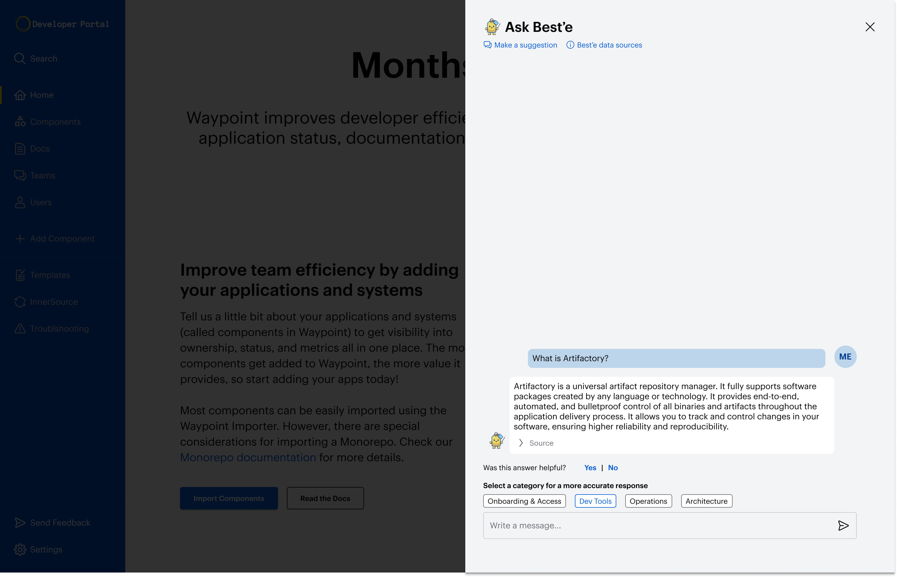
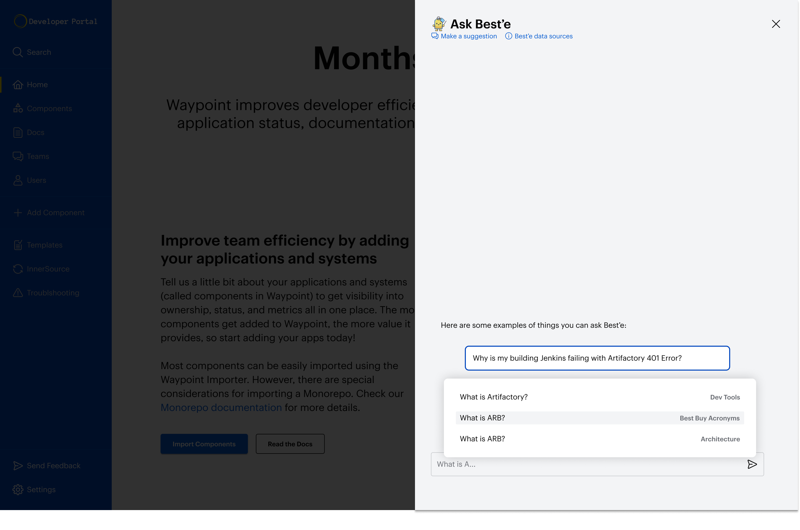

import BlogImage from '../../components/BlogImage.astro'
import fdbkimg from '../../assets/beste/positivefeedback.png'
import FullBleedSection from '../../components/FullBleedSection.astro'
import StandardSection from '../../components/StandardSection.astro'

<BlogImage src={fdbkimg} alt="Beste feedback"/>

<StandardSection>

## Problem
### Discoverability is a major issue for Best Buy engineers
It’s not easy to discover information within Best Buy. There’s too many teams, services, and tools for anybody to keep track of and information is spread across Confluence, Slack, GitHub, and other tools. Finding accurate and up-to-date information frequently comes down to knowing who to ask, which presents barriers to new team members and doesn’t work at scale. Engineers waste an estimated 80,000 hours a year searching for information.

Best’e can reduce the amount of time spent searching for information by answering basic questions about common problems, tools, services, policies, and acronyms at Best Buy.

## Design
### Crafting the Best'e UI
Best’e is located in the Best Buy Internal Developer Portal. It’s accessed via a floating action button on every page, which opens up a side panel, so that users can ask questions within the context of whatever they’re working on.

#### Best’e users are invested
Because Best’e is an internal tool for Best Buy engineers, users are extremely invested in making useful suggestions, and are very interested in where Best’e is pulling its data from.

Users are prompted to rate Best’e’s response to each question and can follow-up with quick responses or free form text. 80% of users who engage with the feedback widget opt to leave a comment.

Users can also make general suggestions for improving Best’e, including recommending answers to questions or suggesting new data sets. Every suggestion is reviewed by a member of the Best’e team.

Because users are so invested in Best’e (and because the audience is pretty nerdy) many of them want to know what data sets Best’e is pulling from. So we added a link to more documentation about Best’e that includes its data sources. The initial set includes 15 slack help channels, roughly a dozen confluence spaces, Best Buy acronyms, and additional internal documentation.

In order to make Best’e more trustworthy, we added attribution, so people can see the exact source (or sources) Best’e is pulling its answer from, as well as the person responsible for the original content.

#### Best’e Experiments
Gen-AI assistants are still relatively new and rapidly evolving, so in addition to these core features, the team also introduced a few experiments to improve the Best'e experience.

During the alpha release of Best’e, users were encouraged to experiment with different Large Language Models to see which was giving the most accurate responses. Users could use the drop down menu to select different options.

Unlike more robust LLMs, Best’e doesn’t recognize when a prompt is a response to previous answer or whether it’s a new question. To aid users in refining their questions, we experimented with threaded responses.

We had some issues early on with topics that could be answered very differently in different contexts, so we were experimenting with letting users pick from potential categories, or showing the category Best’e thought it was answering in order to hone in on the best answer.

We found that users were asking a lot of the same questions over and over, so we focused a lot of effort on ensuring the accuracy of those answers. We also added an autocomplete feature for frequent questions.

## Results
The initial response to Best'e has been quite positive, and engineers have been eager to test it out. It's still in the early stages of development and is relying on a fairly small number of data sources, which limits the types of questions that can be answered. However, given its early success, we are confident that as we add more data sources Best'e will deliver tremendous value towards improving developer efficiency.
</StandardSection>
