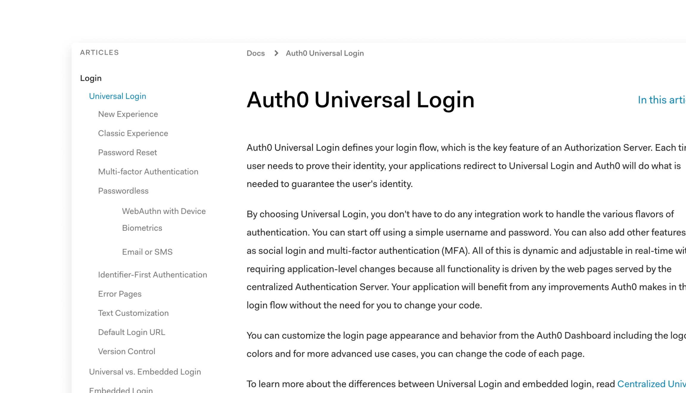
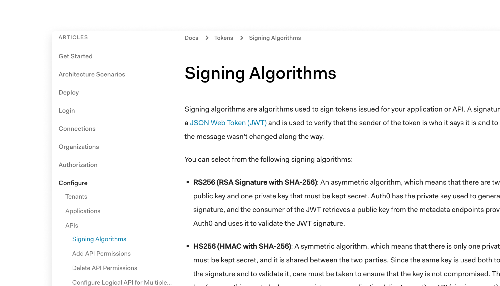
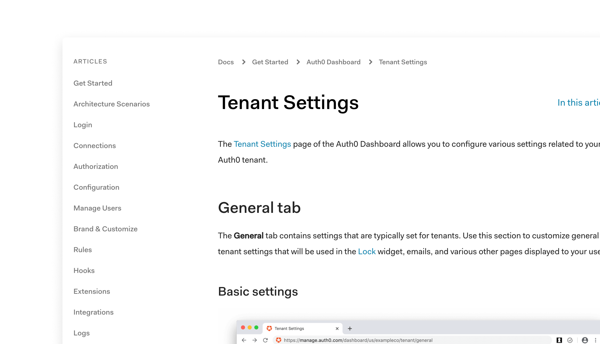
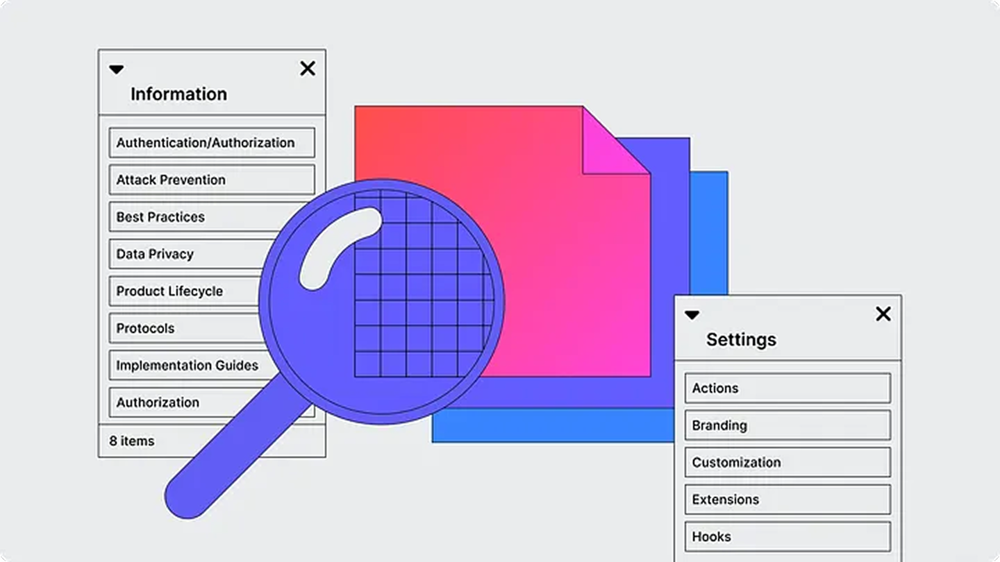
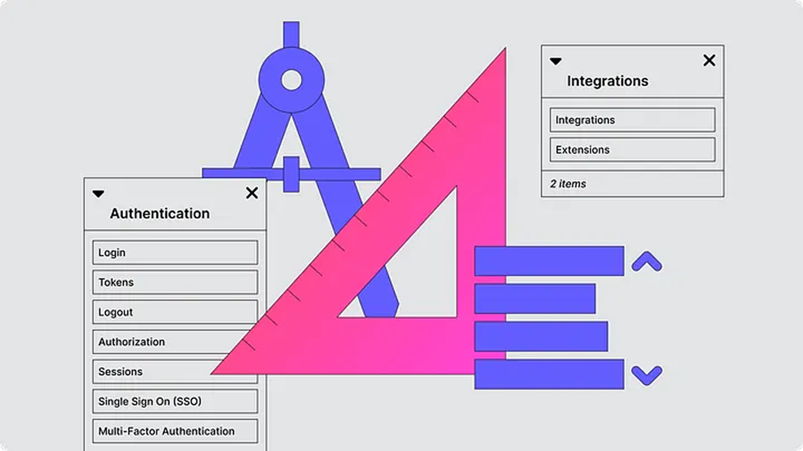
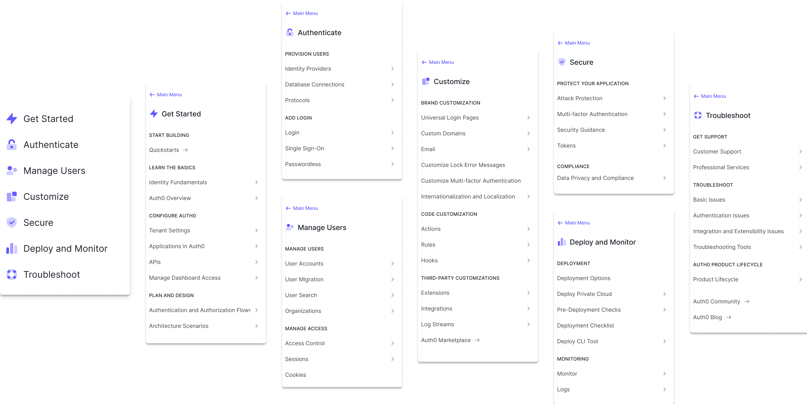
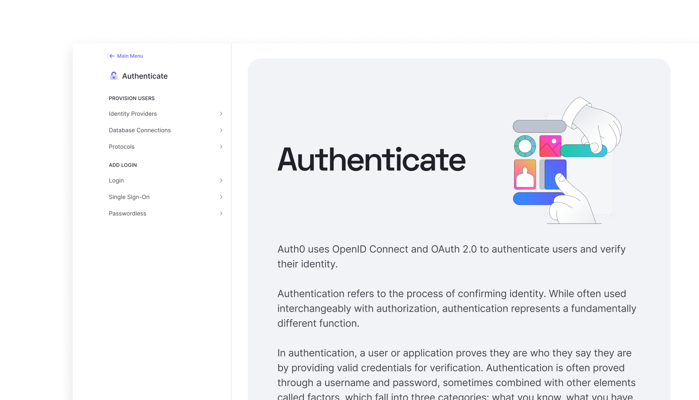
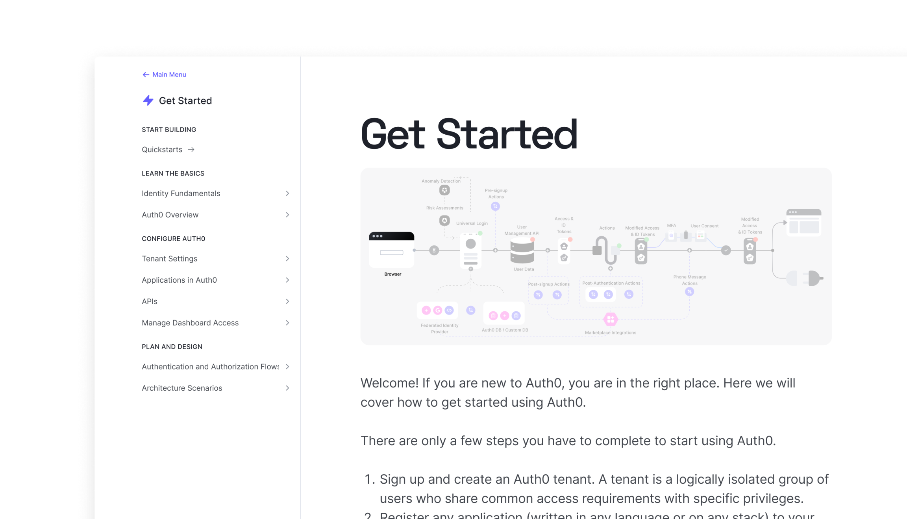
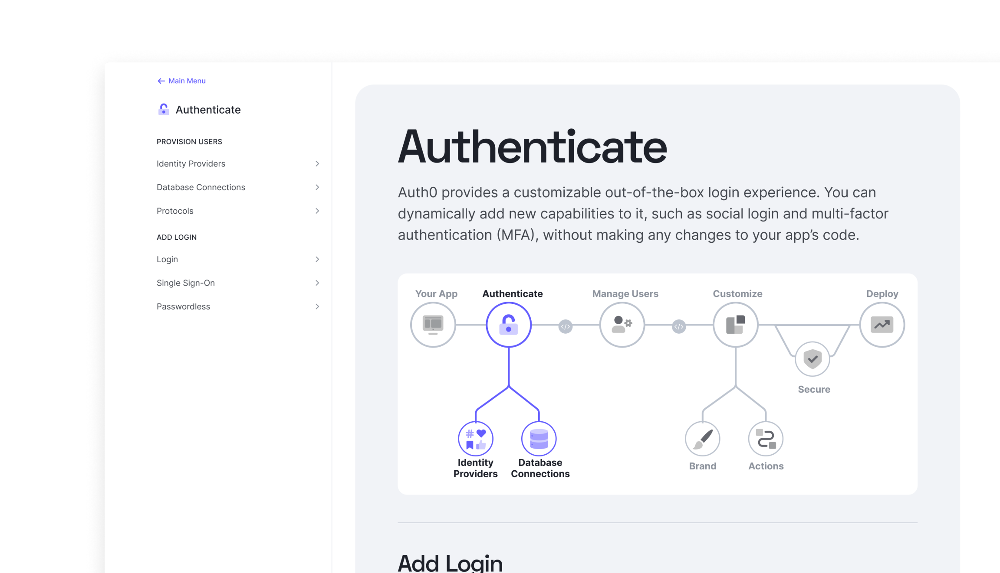

import StandardSection from '../../components/StandardSection.astro'

<StandardSection>

## Auth0 Docs - love ‘em or hate ‘em
We got a lot of feedback that our docs were amazing. They were frequently cited as a competitive differentiator. We also got a lot of feedback that our docs were terrible and impossible to navigate.

I set out to find out why.

### Experience level was a key factor
Developers who liked our docs:

- Had more pre-existing Identity and Access management (IAM) knowledge
- Relied more on Google searches to find docs or community forum posts

Developers who struggled with our docs:
- Had less Identity and Access management (IAM) knowledge
- Relied more on our sidebar navigation because they didn’t know the concepts well enough to choose good search terms
- Ended up jumping back and forth between lots of open of tabs

## Making sense of the mess
I performed a content audit of all 1000+ pages of docs, putting together a massive spreadsheet highlighting the problems in the IA. (I am precisely the kind of nerd 🤓 who loves this stuff).

Our sidebar navigation was manually generated, but our breadcrumbs were automatically generated based on the file structure of our CMS.

Over time the two had diverged, leading to a number of mismatches.

Many of the pages had inconsistent hierarchies. Content might be multiple levels deep in the sidebar navigation, but appear to be at the top level in the breadcrumb navigation.

Other pages had mismatches where the content resided in completely different categories in the sidebar versus the breadcrumbs.

Worst of all, a whopping 54% of pages were orphans that didn't show up in the sidebar navigation at all.

75%

of pages had a mismatch between the sidebar and breadcrumbs

21%

of pages had either mismatched parent categories or inconsistent hierarchies

54%

of pages that were orphaned and didn’t show up in the sidebar navigation

### Card sorting to understand mental models
Users typically took one of two approaches:

Topics grouped by task, creating groups based on a user’s journey through setting up and configuring Auth0

Topics grouped by feature, creating groups around authentication users, securing their applications, or configuring different integrations

### Wayfinding to validate
To validate the results of the card sorting, I followed up with wayfinding tests for both a task-based IA and a feature-based IA.

Once again, different people had different mental models about how the topics should be grouped. Overall, however, more people were successful with the feature-based navigation and reported preferring that option.

"I preferred the [Feature-based] experience because the top bar navigation was segmented more and the headlines were much less ambiguous."

## Breaking up the monolith
Based on my findings from the card sorting and wayfinding tests, I split the docs content into 7 main categories, each with their own sub-menu:

Get started

Authentication

Manage Users

Customize

Secure

Deploy and Monitor

Troubleshoot

an image of the new sidebars
Landing pages provide a high-level overview
We wanted to introduce developers to each of these sections, while also helping them get a better high level understanding of the Auth0 product.

Our technical writing staff developed new content for each landing page and the homepage and I tested three different design ideas with users.

The second design featured a detailed architectural diagram of the Auth0 ecosystem. The software architect I interviewed liked this view, but acknowledged it would probably be better deeper in the documentation. The other developers found it to be too complex for a landing page.

The final design used a simplified diagram that provided users with a big picture overview of the Auth0 pipeline. Testers unanimously preferred this option, and thought that it provided just the right level of detail.

## Finalizing the Design
I made some small tweaks based on some of the feedback from our usability testing and then designed the new sidebar sections.

I paired with our frontend engineering team to iterate on the behavior of the new sidebar, how users would move from one section to another, and the mobile version of the navigation menu.

## Results
With no set path through our documentation, it is difficult to quantitatively measure the impact of information architecture. Metrics can tell us if a user is staying on a certain page for more or less time than before, but they can't tell us if that's because they found the information they needed more quickly or because they were in the wrong place.

Therefore, most of the impact of this initiative was measured through qualitative feedback, including follow-up interviews with users, and monitoring the feedback from the customer satisfaction widget embedded on every page of our documentation.

The response to the new design was overwhelmingly positive, with users reporting that the new menus were much easier to navigate and that the landing pages gave them more context and helped them get a better sense of the Auth0 product as a whole.
</StandardSection>
