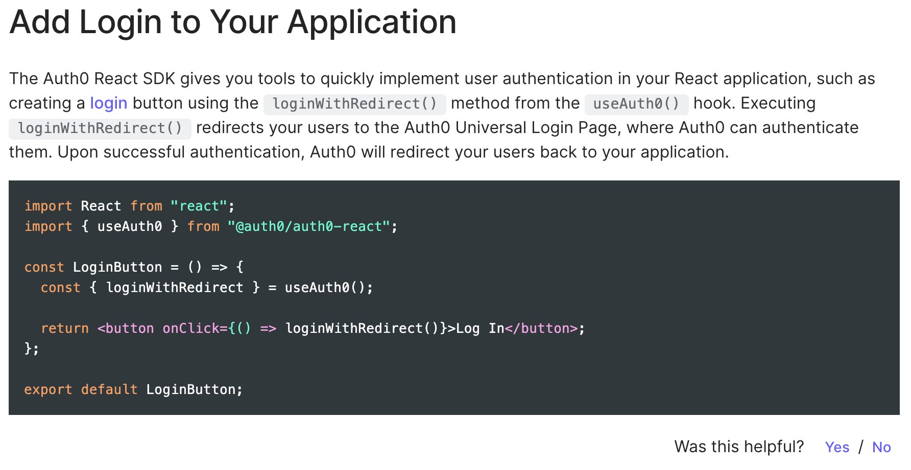
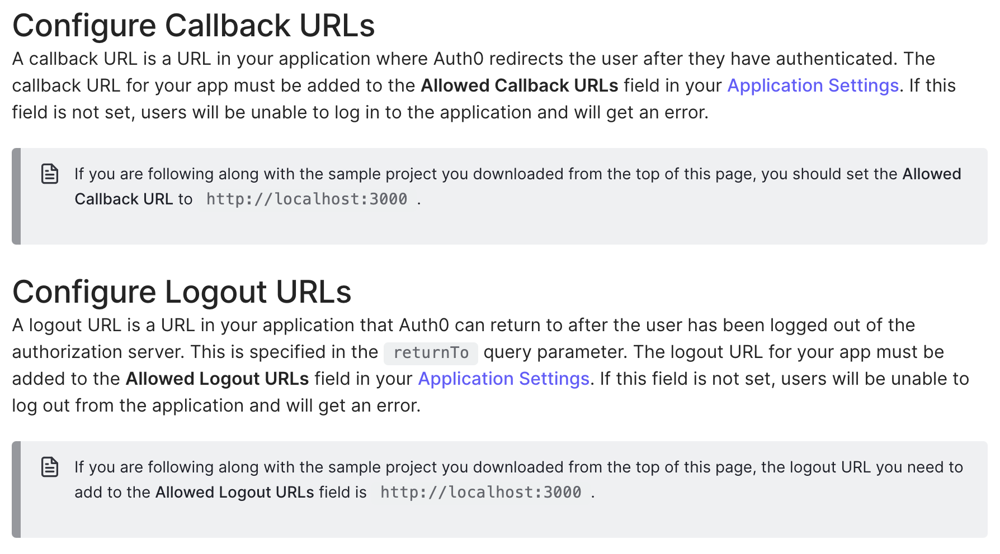
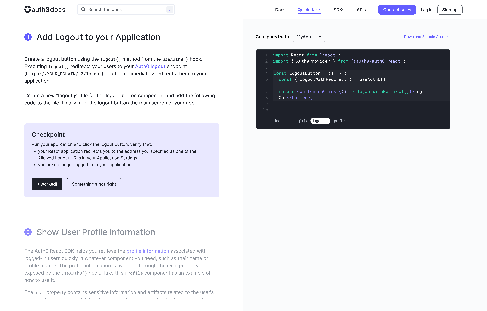
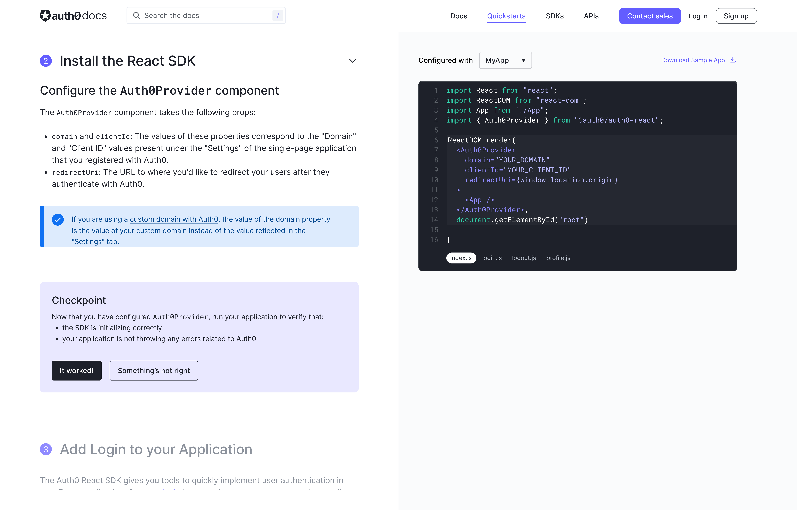
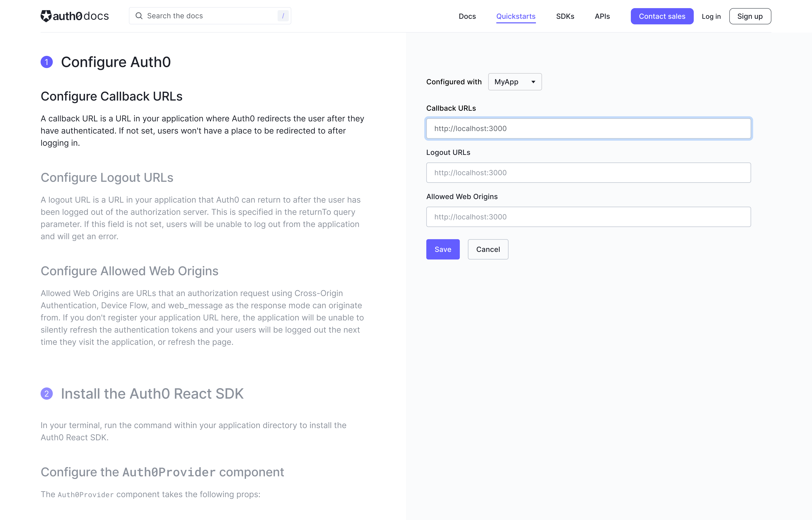

## Problem
### Identifying pain points
In order to get a better understanding of what developers liked about our quickstarts as well as areas for improvement, we kicked off this project by conducting a usability test on our existing quickstarts.

#### Incomplete code samples
The code samples provided in the quickstart were incomplete snippets and failed to call out a specific file name for where to put the code. 

While more experienced React developers generally figured this step out without assistance, we noticed that it was something novice developers really struggled with.

#### Too much context switching
In order to follow along with the quickstart, users would have to navigate to the Auth0 dashboard to enter their callback, logout, and web origins URLs, then copy the information from the quickstart into their code editor. 

This context switching slowed down the integration process, and created a less focused experience. It was also prone to error, as users frequently forgot to save their URLs in the dashboard.

## Design
### New Design Offers More Interactivity
With the new design, users can check out the code samples, copy code snippets, or download all the files at once to edit in their code editor.

The code samples also update so that the relevant file is displayed as the they scroll through the guide so that the appropriate sample is showing for each step.

By allowing users to configure their callback, logout, and web origins URLs directly from the quickstart we reduced context switching and sped up integration time.

## Research
### Interactive design was a hit with testers
Because this new design was such a significant departure from our previous designs, we wanted to run some usability tests to make sure it was still easy for users to get up and running quickly and to ensure that we weren’t taking the automation too far.

The reactions to the new version of the quickstart were overwhelmingly positive, with participants noting that it was intuitive and easy to use and that having the code samples update as they scrolled through the instructions made following along a “no-brainer.”

>“It’s so clear and so precise that anyone could just follow it step-by-step – it’s broken down in a way that’s much more intuitive to the user.”

## Results
### Final Design and Impact
With the design mostly finalized, I worked with our engineering team on implementation. I had weekly syncs with the engineers and product manager to get status updates and work out the remaining details.
The new quickstart design launched as a beta test in late February 2022. 

We then conducted an additional round of unmoderated usability testing once the quickstarts were live in order to validate the new design.
The feedback on the new design was very positive, with just a few minor UI fixes needed.

The overall time it took for developers to implement a login button on their application dropped from roughly 30 minutes using the original quickstart to approximately 10-15 minutes using the redesigned quickstart.
